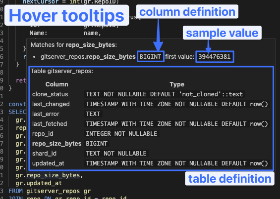

# Wingmate SQL tools

[](https://marketplace.visualstudio.com/items?itemName=chrismwendt.wingmate)
[](https://marketplace.visualstudio.com/items?itemName=chrismwendt.wingmate)

Recognizes SQL queries inside strings and provides syntax highlighting, syntax error detection, hover tooltips, and autocomplete:





Free for non-commercial use.

You need a [subscription](https://buy.stripe.com/fZeaEG6em0Bx6LmbII) for commercial use.

## Configuration

gopls's semantic highlighting prevents SQL syntax highlighting from working. You can disable it with this user setting (hit <kbd>Cmd+comma</kbd> then click the file icon in the top-right):

```json
{
  "gopls.ui.semanticTokens": false
}
```

Some themes don't support semantic highlighting and you need to force it:

```json
{
  "editor.semanticTokenColorCustomizations": {
    "[Gatito Theme]": {
      "enabled": true
    }
  }
}
```

To get autocomplete in strings, you need to enable it:

```json
{
  "editor.quickSuggestions.strings": true
}
```

To get hover tooltips and column name completions, set your database connection:

```json
{
  "wingmate.conn": "postgresql://localhost:5432/postgres"
}
```

You can add custom SQL sinks in the form `function:parameter` to the parser if your DB functions aren't in the default list:

```json
{
  "wingmate.sinks": ["sqlf.Sprintf:0"]
}
```

## Related

- [Inline SQL](https://marketplace.visualstudio.com/items?itemName=qufiwefefwoyn.inline-sql-syntax) supports more languages and performs linting, but doesn't recognize syntax as well and I couldn't get linting to work
- [Highlight String Code](https://marketplace.visualstudio.com/items?itemName=iuyoy.highlight-string-code) supports more langauges and a few other features
- [python-string-sql](https://marketplace.visualstudio.com/items?itemName=ptweir.python-string-sql) for Python
- [SQL tagged template literals](https://marketplace.visualstudio.com/items?itemName=frigus02.vscode-sql-tagged-template-literals) for JS/TS
- [vscode-sql-template-literal](https://marketplace.visualstudio.com/items?itemName=forbeslindesay.vscode-sql-template-literal) for JS/TS

## Star History

[](https://star-history.com/#chrismwendt/wingmate&Date)
